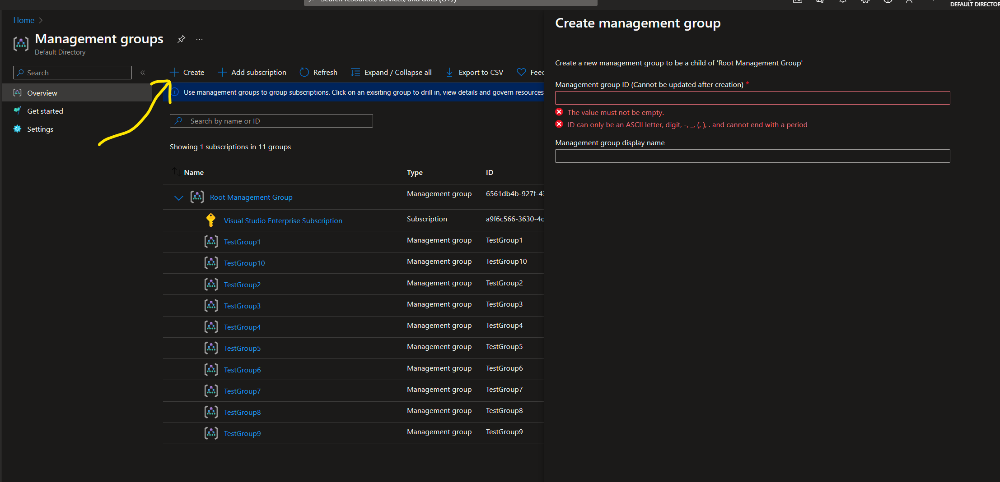

# Programmatic Compliance

## What is the Programmatic Compliance tool? 

Microsoft and its customers follow a shared responsibility model regarding security and compliance of the Microsoft Cloud environment. With the Programmatic Compliance tool, customers can evaluate the compliance of multiple services at the same time based on industry standards helping to improve time-to-value and accelerate innovation. 

The Programmatic Compliance tool revolutionizes the compliance experience, delivering **unified**, **machine-readable**, and **retrievable** compliance data.  

- **Unified**: A singular source for all compliance data. 
- **Machine-Readable**: Seamlessly integrates with other systems via public API 
- **Retrievable**: Unfettered access to the latest compliance information.

### Use-cases and capabilities 

The Programmatic Compliance tool, deployed as a webapp to your Azure Subscription, focuses on enabling three pivotal personas and their scenarios within the compliance lifecycle, while also providing a solution that includes lookup by standard and service, along with a pre-deployment scenario: 

- A Compliance Officer needs to ensure Microsoft provides compliance capabilities for a given service, to meet the company’s industry/internal standards.  
- The Service Owner needs to assess risk for the service and evaluate the controls and policies to approve/deny a service for deployment. 
- The Cloud Architect needs to understand any actions they need to take to configure and maintain the compliance and security of each service within their solution.  

In a few clicks, customers can easily find and export the relevant compliance information for reporting or deployment. 

## Installation

### Option 1: Deploy to Storage Account Static Website 

Below is the process of deploying the Programmatic Compliance website to an Azure Storage Account Static Website. 

#### Prerequisites

Before starting, ensure you have the following installed:

- [Node.js](https://nodejs.org/en/) (v14 or higher)
- [Azure CLI](https://docs.microsoft.com/en-us/cli/azure/install-azure-cli)

#### Steps

##### 1. Build the Programmatic Compliance Application

First of all you will need to build the Programmatic Compliance Application for production:

```bash
npm install
npm run build
```

This will generate the production build in the `dist` folder.

##### 2. Create an Azure Storage Account

Now, create a storage account in Azure where the static website will be hosted. Run the following commands in the Azure CLI:

```bash
# Log in to Azure
az login

# Create a resource group (optional)
az group create --name <resource-group-name> --location <location>

# Create a storage account
az storage account create \
  --name <storageAccountName> \
  --resource-group <resource-group-name> \
  --location <location> \
  --sku Standard_LRS \
  --kind StorageV2 \
  --allow-blob-public-access false \
  --allow-shared-key-access false
```

- Replace `<resource-group-name>`, `<storageAccountName>`, and `<location>` with appropriate values.
- The storage account kind should be `StorageV2` to support static website hosting.
- Ensure you have minimum `Contributor` permissions on the resource group you are deploying to.

##### 3. Enable Static Website Hosting

After creating the storage account, enable static website hosting using the following command:

```bash
az storage blob service-properties update \
  --account-name <storageAccountName> \
  --static-website \
  --index-document index.html \
  --404-document 404.html
```

- Replace `<storageAccountName>` with the name of your storage account.
- Ensure that the `index.html` and `404.html` files are included in the build output of your React project.

##### 4. Upload the website Build to Azure

Once static website hosting is enabled, upload your website's build to the storage account. The built files (from the `dist` folder) need to be uploaded as blobs. You can upload them using the Azure CLI:

```bash
az storage blob upload-batch \
  --account-name <storageAccountName> \
  --source ./dist \
  --destination '$web'
```

- Replace `dist` with your build folder if necessary (for `create-react-app`, use `build`).
- `$web` is a special container for hosting static website content.

##### 5. Access the Deployed Website

After successfully uploading your files, you can get the URL for your static website:

```bash
az storage account show \
  --name <storageAccountName> \
  --query "primaryEndpoints.web" \
  --output tsv
```

This command will return the URL where your website is hosted. Open the URL in a browser to verify that your website is working as expected.

#### Next steps

Congratulations! You have successfully deployed the Programmatic Compliance website to an Azure Storage account with static website hosting! You can now manage your website through Azure and update it by uploading new build files as necessary.

If you want to add a custom domain and SSL to your website, you can refer to [Azure's custom domain documentation](https://docs.microsoft.com/en-us/azure/storage/blobs/storage-blob-static-website-custom-domain) for further steps.

### Option 2: Deploy to Azure Static Web App

Follow these steps to deploy your React website to an Azure Static Web App using the `swa` CLI tool.

#### Prerequisites

Before starting, ensure you have the following installed:

- [Node.js](https://nodejs.org/en/) (v14 or higher)
- [Azure CLI](https://docs.microsoft.com/en-us/cli/azure/install-azure-cli)

#### Steps

##### 1. Install the Azure Static Web Apps CLI

First, install the Static Web Apps CLI globally:

```bash
npm install -g @azure/static-web-apps-cli
```

This tool will help you simulate, develop, and deploy static websites to Azure Static Web Apps.

##### 2. Build the Programmatic Compliance Application

Build the Programmatic Compliance Application using the commands below:

```bash
npm install
npm run build
```

This will generate the production build in a `dist` folder.

##### 3. Deploy Using Azure SWA CLI

To deploy your React app to Azure Static Web Apps, use the `swa` CLI. Make sure you’re logged in to Azure first:

```bash
az login
```

Then, deploy the website using the `swa deploy` command:

```bash
swa deploy ./dist --app-name <appName> --resource-group <resource-group-name> --env production
```

Explanation:
- `<appName>` is the name of your Azure Static Web App.
- `<resource-group-name>` is the Azure resource group where the app will be created.
- `--env production` ensures the app is available on the the Static Web App's production hostname. 

##### 4. Access Your Deployed App

Once the deployment is complete, the CLI will return a URL where your static website is hosted. You can access your website at this URL.

If you need to find the URL later, you can retrieve it by running the following command:

```bash
az staticwebapp show --name <appName> --resource-group <resource-group-name> --query "defaultHostname"
```

This command will return the URL for your deployed app.

##### 5. Simulate Local Deployment (Optional)

The SWA CLI also allows you to simulate the app locally to test before deploying. You can run:

```bash
swa start ./dist
```

This will serve your site locally at `http://localhost:4280`, so you can view it in a browser before deploying to Azure.

##### (Optional) 6. Continuous Deployment (CI/CD) Setup

If you want to automate future deployments via GitHub or other CI/CD pipelines, Azure Static Web Apps supports [continuous deployment workflows](https://docs.microsoft.com/en-us/azure/static-web-apps/build-configuration). You can easily set this up by integrating GitHub Actions or other CI tools for automated builds and deployments.

## OPTIONAL: Configure your tenant for custom policy definitions creation

> [!NOTE]
> Optionally, one may use the custom manual policies for the purpose of manual attestation when automated policies are not available or partially address a control. The custom manual policies are not required by the UX or Azure Resource Graph API based retrieval of programmatic compliance information.

#### 1. Local machine configuration

- Download the latest version of [PowerShell](https://learn.microsoft.com/en-us/powershell/scripting/install/installing-powershell-on-windows?view=powershell-7.4)

- Download the latest version of [Az PowerShell](https://learn.microsoft.com/en-us/powershell/azure/install-azps-windows?view=azps-11.4.0&tabs=powershell&pivots=windows-psgallery#update-the-az-powershell-module). If already installed, update the module if needed.

- Clone the project to your local repository.

```
git clone git@github.com:microsoft/ProgrammaticCompliance.git
Set-Location -Path .\ProgrammaticCompliance
git checkout develop
git branch
```

You should be under the _develop_ branch.

> [!NOTE]
> If the clone doesn't work, you don't have git downloaded. Execute the following command first and then try again.
>
> ```
> winget search Git.Git
> winget install --id Git.Git -e --source winget
> ```

- Set the working directory to the PowerShell scripts directory:

```
Set-Location -Path .\CustomPolicies\PowerShell
```

- Run the environment set up script with PowerShell elevated (Administrator) privileges:

```
.\EnvConfig.ps1
```

#### 2. Log into the Azure tenant where custom policies will be installed

You can configure a service principal and give it enough privileges to create the custom policies.

- To run the login script with service principal use:

```
.\Login.ps1 -ApplicationId <Service Principal client ID> -TenantId <Tenant ID>
```

- To run the login script with the interactive auth, run the script with just the tenant ID as a parameter:

```
.\Login.ps1 -TenantId <Tenant ID>
```

#### 3. Create the custom policies

> [!NOTE]
> A management group can only hold up to 500 policy definitions. With this in mind, since there are over 4000 policy definitions to create, this process will create ~9 management groups that will together host all of the policy definitions. Once the policy definitions become built-in, this step will no longer be needed.

- Elevate your access to manage all of your subscription's management groups by following the steps [here](https://learn.microsoft.com/en-us/azure/role-based-access-control/elevate-access-global-admin?tabs=azure-portal)
- If you need to add others to access your custom policies, navigate to _IAM_ in the root management group portal and assign the _Reader_ role to them.
  > [!IMPORTANT]
  > You can create a custom role that only has permissions to read the policy definitions and policy metadata resources. Assign that custom role to users so that they do not have access to all of the other resources under the root management group.
- Create the management groups in which the custom policies will be created (about 9 management groups are needed to host the custom policy definitions)
  

- Create the custom policy definitions resources

  - with an interactive login:

  ```
  .\PoliciesCreate.ps1 -TenantId <Tenant ID> -ManagementGroupIds <Array of the created management group names (comma separated)>
  ```

  Example:

  ```
  .\PoliciesCreate.ps1 -TenantId XXXX -ManagementGroupIds TestGroup1,TestGroup2,TestGroup3,TestGroup4,TestGroup5,TestGroup6,TestGroup7,TestGroup8,TestGroup9
  ```

  - with a service principal:

  ```
  .\PoliciesCreate.ps1 -TenantId <Tenant ID> -ApplicationId <Service Principal ID> -ManagementGroupIds <Array of the created management group names (comma separated)>
  ```

  Example:

  ```
  .\PoliciesCreate.ps1 -TenantId XXXX -ApplicationId AAAA -ManagementGroupIds TestGroup1,TestGroup2,TestGroup3,TestGroup4,TestGroup5,TestGroup6,TestGroup7,TestGroup8,TestGroup9
  ```

- Delete the custom policy definitions resources when they are not needed
  - with an interactive login:
  ```
  .\PoliciesCleanUp.ps1 -TenantId <Tenant ID> -ManagementGroupIds <Array of the created management group names (comma separated)>
  ```
  Example:
  ```
  .\PoliciesCleanUp.ps1 -TenantId XXXX -ManagementGroupIds TestGroup1,TestGroup2,TestGroup3,TestGroup4,TestGroup5,TestGroup6,TestGroup7,TestGroup8,TestGroup9
  ```
  - with a service principal:
  ```
  .\PoliciesCleanUp.ps1 -TenantId <Tenant ID> -ApplicationId <Service Principal ID> -ManagementGroupIds <Array of the created management group names (comma separated)>
  ```
  Example:
  ```
  .\PoliciesCleanUp.ps1 -TenantId XXXX -ApplicationId AAAA -ManagementGroupIds TestGroup1,TestGroup2,TestGroup3,TestGroup4,TestGroup5,TestGroup6,TestGroup7,TestGroup8,TestGroup9
  ```

## Licensing and Disclaimers.

The Programmatic Compliance Preview (the "Preview") is licensed to you as part of your Azure subscription and subject to terms applicable to "Previews" as detailed in the Universal License Terms for Online Services section of the Microsoft Product Terms and the Microsoft Products and Services Data Protection Addendum ("DPA"). AS STATED IN THOSE TERMS, PREVIEWS ARE PROVIDED "AS-IS," "WITH ALL FAULTS," AND "AS AVAILABLE," AND ARE EXCLUDED FROM THE SERVICE LEVEL AGREEMENTS AND LIMITED WARRANTY. MICROSOFT MAKES NO WARRANTY THAT THE DATA AND CONTENT PROVIDED AS PART OF THE PREVIEW IS ACCURATE, UP-TO-DATE, OR COMPLETE. THE PREVIEW (1) IS NOT DESIGNED, INTENDED, OR MADE AVAILABLE AS LEGAL SERVICES, AND (2) IS NOT INTENDED TO SUBSTITUTE FOR PROFESSIONAL LEGAL COUNSEL OR JUDGMENT. THE DATA AND CONTENT PROVIDED THROUGH THE PREVIEW SHOULD NOT BE USED IN PLACE OF CONSULTING WITH A QUALIFIED PROFESSIONAL LEGAL PROFESSIONAL FOR YOUR SPECIFIC NEEDS. Previews may employ lesser or different privacy and security measures than those typically present in Azure Services. Unless otherwise noted, Customer should not use Previews to process Personal Data or other data that is subject to legal or regulatory compliance requirements. The following terms in the DPA do not apply to Previews: Processing of Personal Data; GDPR, Data Security, and HIPAA Business Associate. We may change or discontinue Previews at any time without notice. We also may choose not to release a Preview into General Availability.

## Contributing
For details on contributing to this repository, see the contributing guide.

This project welcomes contributions and suggestions. Most contributions require you to agree to a Contributor License Agreement (CLA) declaring that you have the right to, and actually do, grant us the rights to use your contribution. For details, visit https://cla.microsoft.com.

When you submit a pull request, a CLA-bot will automatically determine whether you need to provide a CLA and decorate the PR appropriately (e.g., label, comment). Simply follow the instructions provided by the bot. You will only need to do this once across all repositories using our CLA.

This project has adopted the Microsoft Open Source Code of Conduct. For more information see the Code of Conduct FAQ or contact opencode@microsoft.com with any additional questions or comments.


