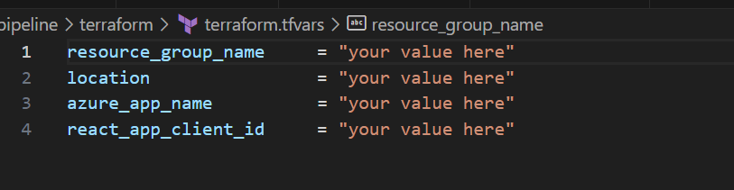
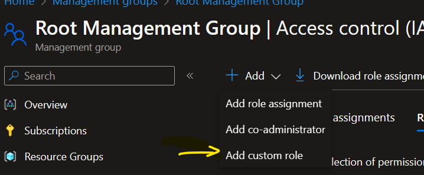
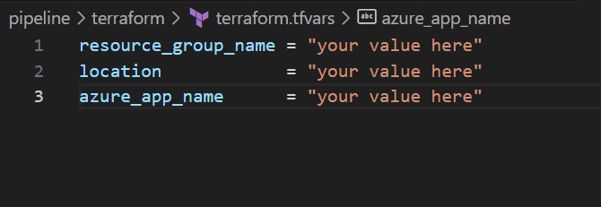

# Programmatic Compliance

## Preview Terms.

**<u>Licensing and Disclaimers.</u>** The Programmatic Compliance Preview (the "Preview") is licensed to you as part of your Azure subscription and subject to terms applicable to "Previews" as detailed in the Universal License Terms for Online Services section of the Microsoft Product Terms and the Microsoft Products and Services Data Protection Addendum ("DPA"). AS STATED IN THOSE TERMS, PREVIEWS ARE PROVIDED "AS-IS," "WITH ALL FAULTS," AND "AS AVAILABLE," AND ARE EXCLUDED FROM THE SERVICE LEVEL AGREEMENTS AND LIMITED WARRANTY. MICROSOFT MAKES NO WARRANTY THAT THE DATA AND CONTENT PROVIDED AS PART OF THE PREVIEW IS ACCURATE, UP-TO-DATE, OR COMPLETE. THE PREVIEW (1) IS NOT DESIGNED, INTENDED, OR MADE AVAILABLE AS LEGAL SERVICES, AND (2) IS NOT INTENDED TO SUBSTITUTE FOR PROFESSIONAL LEGAL COUNSEL OR JUDGMENT. THE DATA AND CONTENT PROVIDED THROUGH THE PREVIEW SHOULD NOT BE USED IN PLACE OF CONSULTING WITH A QUALIFIED PROFESSIONAL LEGAL PROFESSIONAL FOR YOUR SPECIFIC NEEDS. Previews may employ lesser or different privacy and security measures than those typically present in Azure Services. Unless otherwise noted, Customer should not use Previews to process Personal Data or other data that is subject to legal or regulatory compliance requirements. The following terms in the DPA do not apply to Previews: Processing of Personal Data; GDPR, Data Security, and HIPAA Business Associate. We may change or discontinue Previews at any time without notice. We also may choose not to release a Preview into General Availability.

**<u>Feedback.</u>** By accessing the Preview, you consent to providing, during several mutually agreed calls of approximately 30 minutes during the timeframe of April through June 2024, suggestions, comments, input and other feedback on the Preview (“Feedback”), which may include Feedback regarding other Microsoft pre-release and commercially available products, services, solutions and technologies that may be used in conjunction with Programmatic Compliance. Feedback may be used, disclosed, and exploited by Microsoft for any purpose without restriction and without obligation of any kind to you. Microsoft is not required to implement Feedback.

**<u>Confidentiality.</u>** The Preview and any associated materials or documentation are confidential information and subject to obligations in your Non-Disclosure Agreement with Microsoft.


## 1. Configure your tenant for custom policy definitions creation
> [!NOTE]
> The custom policies creation process is strictly for a non-production/testing environment (tenants or subscriptions) and destined for any user allowed in private preview. Once the policies are made available as built-ins, it is recommended to use the cleanup scripts to delete all the custom policies created during the private preview phase.

### A. Local machine configuration
* Download the latest version of [PowerShell](https://learn.microsoft.com/en-us/powershell/scripting/install/installing-powershell-on-windows?view=powershell-7.4)

* Download the latest version of [Az PowerShell](https://learn.microsoft.com/en-us/powershell/azure/install-azps-windows?view=azps-11.4.0&tabs=powershell&pivots=windows-psgallery#update-the-az-powershell-module). If already installed, update the module if needed.

* Clone the project to your local repository.
```
git clone git@github.com:microsoft/ProgrammaticCompliance.git
Set-Location -Path .\ProgrammaticCompliance
git checkout develop
git branch
```
You should be under the _develop_ branch.
> [!NOTE]
> If the clone doesn't work, you don't have git downloaded. Execute the following command first and then try again.
> ```
> winget search Git.Git
> winget install --id Git.Git -e --source winget
> ```
* Set the working directory to the PowerShell scripts directory:
```
Set-Location -Path .\CustomPolicies\PowerShell
```
* Run the environment set up script with PowerShell elevated (Administrator) privileges:
```
.\EnvConfig.ps1
```

### B. Log into the Azure tenant where custom policies will be installed
You can configure a service principal and give it enough privileges to create the custom policies.
* To run the login script with service principal use:
```
.\Login.ps1 -ApplicationId <Service Principal client ID> -TenantId <Tenant ID>
```
* To run the login script with the interactive auth, run the script with just the tenant ID as a parameter:
```
.\Login.ps1 -TenantId <Tenant ID>
```

### C. Create the custom policies
> [!NOTE]
> A management group can only hold up to 500 policy definitions. With this in mind, since there are over 4000 policy definitions to create, this process will create ~9 management groups that will together host all of the policy definitions. Once the policy definitions become built-in, this step will no longer be needed.
* Create the management groups in which the custom policies will be created (about 9 management groups are needed to host the custom policy definitions)


* Create the custom policy definitions resources
    - with an interactive login:
    ```
    .\PoliciesCreate.ps1 -TenantId <Tenant ID> -ManagementGroupIds <Array of the created management group names (comma separated)>
    ```
    Example: 
    ```
    .\PoliciesCreate.ps1 -TenantId XXXX -ManagementGroupIds TestGroup1,TestGroup2,TestGroup3,TestGroup4,TestGroup5,TestGroup6,TestGroup7,TestGroup8,TestGroup9
    ```
    - with a service principal:
    ```
    .\PoliciesCreate.ps1 -TenantId <Tenant ID> -ApplicationId <Service Principal ID> -ManagementGroupIds <Array of the created management group names (comma separated)>
    ```
    Example: 
    ```
    .\PoliciesCreate.ps1 -TenantId XXXX -ApplicationId AAAA -ManagementGroupIds TestGroup1,TestGroup2,TestGroup3,TestGroup4,TestGroup5,TestGroup6,TestGroup7,TestGroup8,TestGroup9
    ```

* Delete the custom policy definitions resources when they are not needed
    - with an interactive login:
    ```
    .\PoliciesCleanUp.ps1 -TenantId <Tenant ID> -ManagementGroupIds <Array of the created management group names (comma separated)>
    ```
    Example:
    ```
    .\PoliciesCleanUp.ps1 -TenantId XXXX -ManagementGroupIds TestGroup1,TestGroup2,TestGroup3,TestGroup4,TestGroup5,TestGroup6,TestGroup7,TestGroup8,TestGroup9
    ```
    - with a service principal:
    ```
    .\PoliciesCleanUp.ps1 -TenantId <Tenant ID> -ApplicationId <Service Principal ID> -ManagementGroupIds <Array of the created management group names (comma separated)>
    ```
    Example: 
    ``` 
    .\PoliciesCleanUp.ps1 -TenantId XXXX -ApplicationId AAAA -ManagementGroupIds TestGroup1,TestGroup2,TestGroup3,TestGroup4,TestGroup5,TestGroup6,TestGroup7,TestGroup8,TestGroup9 
    ```

## 2. Create the Azure Web App that hosts the UX
### A. App registration and roles configurations
* Select _App registrations_ under _Microsoft Entra ID_
* Select _New registration_
* Give a name to the app, e.g. _myapp_
* Under _Redirect URI_, select _Single-Page application(SPA)_ and input _https://webapp.azurewebsites.net_ as a value. Note that the Redirect URI is the URL assigned to the webapp that will be deployed in the subsequent steps. We can come back and update this URI after the webapp is created.
    - Remember to check the boxes for _Access token_ and _ID tokens_
* Click _Register_

* After the app registration succeeds, navigate to its _API Permissions_ panel and select _Add a permission_. We will be adding the following permissions:
    - _Azure Service Management_ with *user_impersonation* permissions.
    - _Microsoft Graph_ with the _User.Read_ permissions.
    - Then click on _Grant admin consent for Microsoft_ to permeate changes.
* Elevate your access to manage all of your subscription's management groups by following the steps [here](https://learn.microsoft.com/en-us/azure/role-based-access-control/elevate-access-global-admin?tabs=azure-portal)
* In case there are other users who need access to the app, first add them to your [tenant](https://learn.microsoft.com/en-us/azure/role-based-access-control/role-assignments-external-users) as guests, then navigate to _IAM_ in the root management group portal and assign the _Reader_ role to them.  
> [!IMPORTANT]
> You can create a custom role that only has permissions to read the policy definitions and policy metadata resources. Assign that custom role to users so that they do not have access to all of the other resources under the root management group.



### B. Azure Webapp deployment
> [!NOTE]
> Terraform is the infrastructure script deployment tool used to set up the UX. You could also use the portal to create the webapp and deploy the UX code. 

* Install the latest version of [terraform](https://developer.hashicorp.com/terraform/install)
* Install the latest version of [Az CLI](https://learn.microsoft.com/en-us/cli/azure/install-azure-cli-windows?tabs=azure-cli)
* Navigate to the terraform scripts root folder:
```
Set-Location -Path .\pipeline\terraform
```
* Create a storage account that hosts the terraform state file (using the bash script code or through the portal) 
* Create a container in the storage account created above that hosts the terraform state file
* Create a ```.tfvars``` file to set up the terraform variables. Make sure the resource group that hosts the UX webapp is different from the resource group of the storage account created in the next step. Below is an example of a ```.tfvars``` file. 

* Login to your tenant and ensure that you are using the target subscription of your choice:
```
az login
az account set -s <subscription id>
az account show
```
* Initialize the terraform backend:
```
terraform init -backend-config="resource_group_name=${BACKEND_STORAGE_ACCOUNT_RG}" -backend-config="storage_account_name=${BACKEND_STORAGE_ACCOUNT_NAME}" -backend-config="container_name=${BACKEND_STORAGE_CONTAINER_NAME}"
```
`BACKEND_STORAGE_ACCOUNT_RG` is the resource group of the storage account that hosts the terraform state file  
`BACKEND_STORAGE_ACCOUNT_NAME` is the storage account that hosts the terraform state file  
`BACKEND_STORAGE_CONTAINER_NAME` is the container of the storage account that hosts the terraform state file

* Create the terraform plan:
```
terraform plan -out plan.tfplan
```
> [!NOTE]
> It's good practice to save the terraform plan file so that when you run the terraform apply command, terraform doesn't try to regenerate another plan.

* Create the infrastructure:
```
terraform apply plan.tfplan
```
> [!IMPORTANT]
> Please update the _Redirect URI_ in the _App registration and roles configurations_ step with the actual URL assigned to the webapp once it is created.

### C. Installations prior to webapp deployment
The following steps should be done in your terminal, from the directory into which you cloned the Git repository.
* Download and install [Node.js](https://nodejs.org/), which includes npm, for your operating system. Use the LTS to avoid any fresh issues with the current version
* To verify that Node.js and npm are installed correctly, open a terminal and run the following commands to check their versions:
```
node -v
npm -v
```
> [!NOTE]
> This UX was built using Node.js v18.17.1 and npm v9.8.1.

* Create a ```.env``` file with the following contents
```
REACT_APP_CLIENT_ID=<your value goes here>
REACT_APP_TENANT_ID=<your value goes here>
REACT_WEBAPP_URL=<your value goes here>
```
The above values are the id of the tenant which hosts the webapp and the app registration and the id of the app registration configured in the  _App registration and roles configurations_ step.
> [!NOTE]
> The name of the above file is indeed ```.env``` - This is the name convention for a React environment variables file. 

* After verifying the previous step, use npm to install project dependencies and wait until completion:

```
npm install
```
> [!NOTE]
> Ignore generated warnings. Following the suggested commands may change the versions of various dependencies and break their relationship.

### D. Deploy the UX code to the webapp created
* Build and create a zip file that contains the source code at the root of the project:
```
npm run build
Compress-Archive -Path * -DestinationPath deployment.zip
```

* Deploy the zip file to the webapp:
```
az webapp deployment source config-zip --resource-group <WEBAPP_RESOURCE_GROUP> --name <WEBAPP_NAME> --src deployment.zip
```

Congratulations! You have now successfully configured and deployed your Programmatic Compliance website. Let the testing begin!
